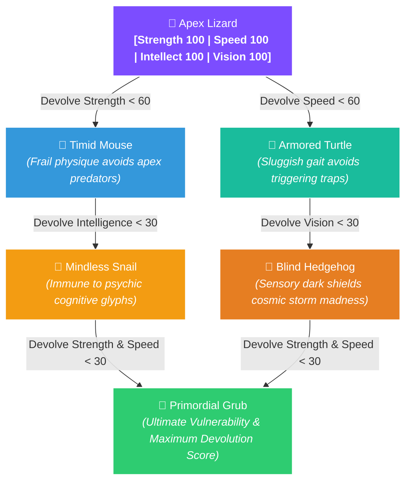
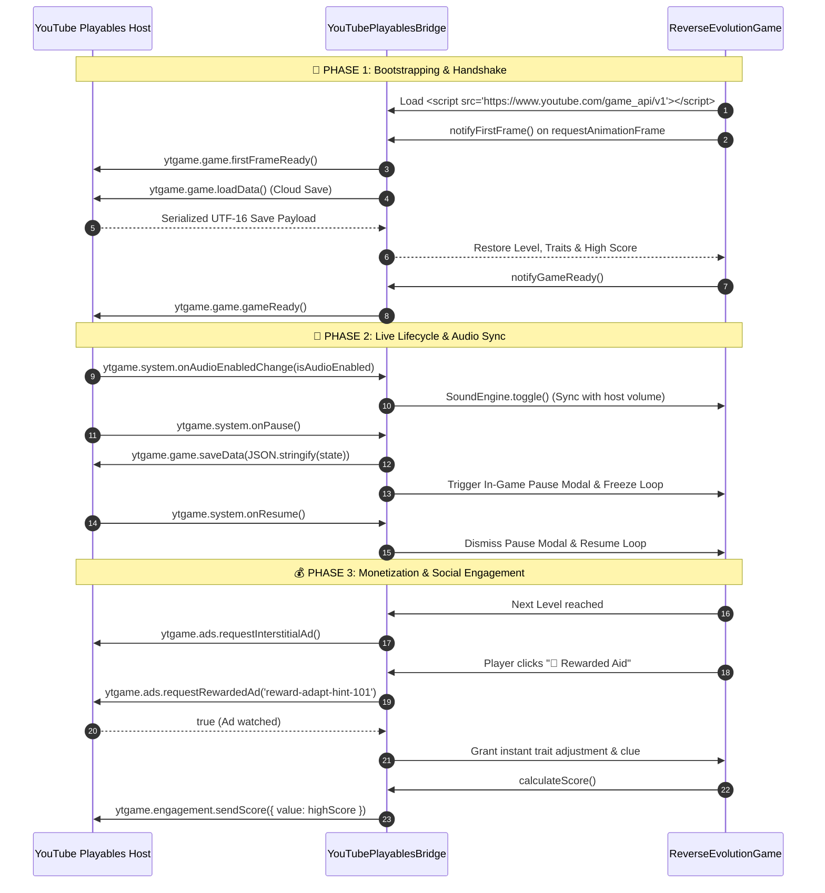

<div align="center">


<br/>

[](https://developers.google.com/youtube/gaming/playables)
[](https://developers.google.com/youtube/gaming/playables)
[](https://developer.mozilla.org/en-US/docs/Web/HTML)
[](https://developer.mozilla.org/en-US/docs/Web/API/Web_Audio_API)
[](https://vercel.com)
[](types/youtube-playables.d.ts)
[](LICENSE)

<br/>

<p align="center">
  <strong>Darwinian Natural Selection, turned completely on its head.</strong><br>
  <em>An inverted survival roguelite built exclusively for the <strong>YouTube Playables</strong> ecosystem.<br>
  Apex predators hunt apex power. To survive, you must shed strength, dim intellect, and embrace glorious vulnerability.</em>
</p>

<br/>

[🕹️ Live Game](#-gameplay--interface-showcase) • [⚡ Playables SDK](#-youtube-playables-sdk-v1-architecture) • [🧬 Evolution Tree](#-metamorphic-morphologies) • [🗺️ The 5 Strata](#-the-five-cosmic-strata) • [🧪 Testing Guide](#-certification--test-suite)

---

</div>

## 🎯 At a Glance

| Feature | Specification |
| :--- | :--- |
| **SDK Standard** | Official **YouTube Playables SDK v1** (`https://www.youtube.com/game_api/v1`) |
| **Security & CSP** | **100% Zero-External-Dependency**; Complies strictly with YouTube sandboxed CSP |
| **Monetization** | Built-in **Interstitial Ads** (strata transitions) & **Rewarded Ads** (tactical adaptation) |
| **Persistence** | **YouTube Cloud Save** (`ytgame.game.saveData` / `loadData`) with `localStorage` fallback |
| **Audio Architecture** | Pure synthesized procedural soundwaves via **Web Audio API** (Oscillators) |
| **Platform Controls** | Dual-mode: Desktop Keyboard (`WASD` / `Arrows`) + Mobile **Virtual D-Pad & Touch** |

---

## 📸 Gameplay & Interface Showcase

<div align="center">
  
</div>

---

## 🌌 The Inverted Lore

> *"In the cradle of the cosmos, the mighty are hunted first. The sharp-minded trigger ancient cognitive bombs. The keen-eyed go blind from celestial auroras. Only the frail, simple, and blind slip through the jaws of natural catastrophe."*

In **Reverse Evolution**, **bigger is NOT better**. Each cosmic stratum is patrolled by hazards tuned to annihilate dominant biological traits:
- **Apex Carnivores** hunger for muscular protein, ignoring puny organisms.
- **Cognitive Runes** detonate only when high-IQ brainwaves scan them.
- **Floral Neurotoxins** saturate large respiratory systems while microscopic bodies pass unharmed.
- **Cosmic Auroras** drive any creature with sharp vision permanently mad.

---

## 🎮 Key Gameplay Systems

<table>
  <tr>
    <td width="50%" valign="top">
      <h3>📉 Strategic Atrophy</h3>
      <p>Strategically downgrade 4 core attributes: <strong>Strength</strong>, <strong>Speed</strong>, <strong>Intelligence</strong>, and <strong>Vision</strong> to slip beneath lethal hazard thresholds before the clock runs out.</p>
    </td>
    <td width="50%" valign="top">
      <h3>🦎 Metamorphic Morphologies</h3>
      <p>Real-time procedural shape-shifting. As your attributes decrease, your physical form mutates from an apex lizard into a timid mouse, blind hedgehog, or primordial grub.</p>
    </td>
  </tr>
  <tr>
    <td width="50%" valign="top">
      <h3>🏆 The Adaptability Crucible</h3>
      <p>Conquer the 5th stratum twist: true survival isn't just zeroing your stats, but calibrating your biology so exactly <strong>ONE</strong> trait dominates above 50.</p>
    </td>
    <td width="50%" valign="top">
      <h3>🔊 Procedural 8-Bit Web Audio</h3>
      <p>100% synthesized sound engine using the Web Audio API. Pure client-side waveforms with <strong>zero external asset requests</strong>, ensuring strict YouTube CSP compliance.</p>
    </td>
  </tr>
  <tr>
    <td width="50%" valign="top">
      <h3>📱 Universal Touch & Virtual D-Pad</h3>
      <p>Engineered for all YouTube Playables form factors: desktop keyboard (WASD / Arrows) and mobile touchscreens with responsive on-screen directional controls.</p>
    </td>
    <td width="50%" valign="top">
      <h3>🎁 Built-in YouTube Monetization</h3>
      <p>Seamlessly integrates YouTube Playables <strong>Interstitial Ads</strong> between strata transitions and <strong>Rewarded Ads</strong> offering tactical genetic hints.</p>
    </td>
  </tr>
</table>

---

## 🧬 Metamorphic Morphologies

Your creature reacts immediately to trait loss with custom avatars, scale shifts, and movement kinetics:



---

## 🗺️ The Five Cosmic Strata

| Strata | Environment | The Hazard Threat | Required Condition | Tactical Advice |
| :---: | :--- | :--- | :---: | :--- |
| **I** | **The Hunting Grounds** | 🦁 Apex carnivores hunt high-protein prey | `Strength ≤ 30` | Atrophy muscles into jelly so predators perceive you as debris. |
| **II** | **The Maze of Minds** | ⚡ Arcane runes detonate upon cognitive scans | `Intelligence ≤ 40` | Dim cognitive neural fire. Ignorance is total safety. |
| **III** | **The Toxic Garden** | 🍄 Heavy spore clouds saturate large lung capacity | `Strength ≤ 20` | Shrink physical cellular size to minimize neurotoxin absorption. |
| **IV** | **The Blinding Storm** | 🌪️ Psychic aurora overloads sensitive optic nerves | `Vision ≤ 35` | Constrict pupils into soothing, restful darkness. |
| **V** | **The Final Test** | 🏛️ Crucible of Adaptability | `Exactly 1 Trait > 50` | Achieve asymmetric balance: keep one trait dominant and all others low. |

---

## ⚡ YouTube Playables SDK v1 Architecture

Reverse Evolution implements the complete official **YouTube Playables SDK** specification:



### SDK Methods Implemented

```javascript
// 1. Initial Handshake & Lifecycle
ytgame.game.firstFrameReady();         // Dispatched on first animation frame
ytgame.game.gameReady();               // Dispatched when game is interactive

// 2. Host System Events
ytgame.system.isAudioEnabled();        // Initial audio status check
ytgame.system.onAudioEnabledChange(fn);// Mute/unmute Web Audio oscillators
ytgame.system.onPause(fn);             // Freeze gameplay & trigger instant cloud save
ytgame.system.onResume(fn);            // Unpause simulation
ytgame.system.getLanguage();           // BCP-47 locale tag (e.g., 'en-US')

// 3. Cloud Persistence (UTF-16, <= 3 MiB)
await ytgame.game.saveData(jsonStr);   // Cloud save
const data = await ytgame.game.loadData();// Cloud load

// 4. Ads Monetization
await ytgame.ads.requestInterstitialAd();
const earned = await ytgame.ads.requestRewardedAd('reward-adapt-hint-101');

// 5. Engagement & Health Telemetry
await ytgame.engagement.sendScore({ value: highScore });
ytgame.health.logError();
ytgame.health.logWarning();
```

---

## 🕹️ Controls & Navigation

<div align="center">

| Action | Desktop Keyboard | Mobile / Touchscreen |
| :--- | :---: | :---: |
| **Move Up** | <kbd>↑</kbd> or <kbd>W</kbd> | Tap <kbd>▲</kbd> D-Pad or Tap Screen |
| **Move Left** | <kbd>←</kbd> or <kbd>A</kbd> | Tap <kbd>◀</kbd> D-Pad or Tap Screen |
| **Move Down** | <kbd>↓</kbd> or <kbd>S</kbd> | Tap <kbd>▼</kbd> D-Pad or Tap Screen |
| **Move Right** | <kbd>→</kbd> or <kbd>D</kbd> | Tap <kbd>▶</kbd> D-Pad or Tap Screen |
| **Devolve Traits** | Click **Devolve** on Trait Panel | Tap **Devolve** button |
| **Watch Rewarded Ad** | Click **🎁 Rewarded Aid** | Tap **🎁 Rewarded Aid** |
| **Pause Game** | Click **⏸️ Pause** | Tap **⏸️ Pause** |
| **Toggle Sound** | Click **🔊 Audio** | Tap **🔊 Audio** |

</div>

---

## 🧪 Certification & Test Suite

### 1. Content Security Policy (CSP)
When served on YouTube, all games run inside a restricted sandbox. Reverse Evolution uses **zero external CDNs, fonts, or assets**, complying 100% with:

```http
default-src 'none'; script-src 'report-sample' 'self' 'unsafe-eval' 'unsafe-inline' blob: https://www.youtube.com/game_api/v0 https://www.youtube.com/game_api/v0/ https://www.youtube.com/game_api/v1 https://www.youtube.com/game_api/v1/; object-src 'none'; style-src 'self' 'unsafe-inline' https://fonts.googleapis.com; img-src 'self' blob: data:; media-src 'self' blob:; font-src 'self' data: https://fonts.googleapis.com https://fonts.gstatic.com; connect-src 'self' blob: data:; sandbox allow-pointer-lock allow-same-origin allow-scripts; base-uri 'self'; manifest-src 'self'; worker-src 'self' blob:
```

### 2. Local Testing with Chrome DevTools Overrides
1. Open Google Chrome and navigate to your locally served game (`http://localhost:8080`).
2. Press <kbd>F12</kbd> to open DevTools.
3. Select **Sources** → **Overrides** → Click **Select folder for overrides**.
4. In the **Network** tab, right-click `index.html` → **Response Headers** → **Add header**.
5. Add `Content-Security-Policy` with the value above.
6. Refresh the page to confirm that zero CSP violations occur in the Console.

### 3. YouTube Playables Test Suite
1. Access the official [YouTube Playables Test Suite](https://developers.google.com/youtube/gaming/playables/test_suite).
2. Enter your deployment URL (e.g. your Vercel deployment link).
3. Validate that all certification checkpoints pass:
   - `First Frame Before Game Ready`: ✅ PASS
   - `Audio Toggle Synchronization`: ✅ PASS
   - `Cloud Save & Load Serialization`: ✅ PASS
   - `Ad Request Handlers & Fallbacks`: ✅ PASS

---

## 📂 Repository File Structure

```
Reverse-Evolution/
│
├── 🚀 index.html                  # Main production game entrypoint (Playables SDK v1)
├── 🔄 reverse-evolution-game.html # Synchronized legacy mirror
├── ⚙️ vercel.json                 # Vercel deployment routing & YouTube CSP headers
│
├── 🖼️ assets/
│   ├── banner.svg                 # Glowing neon hero banner
│   └── game-preview.svg           # Interface showcase mockup
│
├── 📘 types/
│   └── youtube-playables.d.ts     # Official TypeScript typings for ytgame SDK
│
└── 📖 README.md                   # Visual showcase, lore & developer documentation
```

---

## 🚀 Quick Start & Local Development

Run the game locally using any static web server:

```bash
# Clone the repository
git clone https://github.com/Rahul08319/Reverse-Evolution.git
cd Reverse-Evolution

# Option A: Node.js
npx serve .

# Option B: Python 3
python -m http.server 8080

# Option C: PHP
php -S localhost:8080
```

Open `http://localhost:8080` in your browser. The built-in `YouTubePlayablesBridge` will automatically detect the standalone environment and activate local browser fallbacks for cloud saving and ad rewards!

---

<div align="center">

Crafted with 💜 for the **YouTube Playables Ecosystem** • Created by [Rahul Kumar](https://github.com/Rahul08319)

[](https://github.com/Rahul08319)
[](https://github.com/Rahul08319/Reverse-Evolution)

</div>
