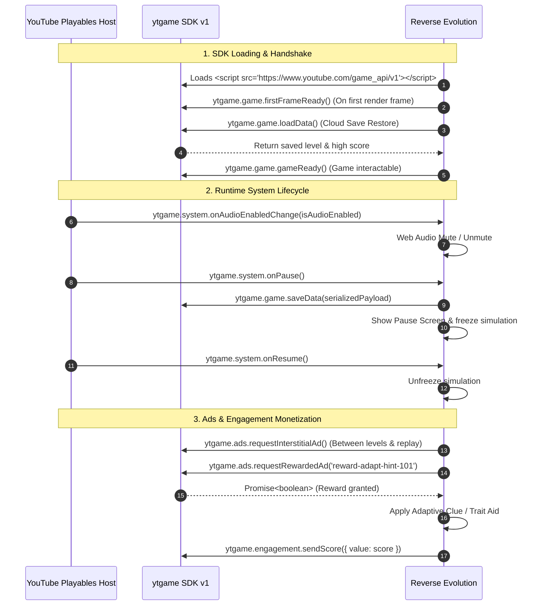

<div align="center">

# 🧬 REVERSE EVOLUTION
### *Survival of the Weakest*

[](https://developers.google.com/youtube/gaming/playables)
[](https://developers.google.com/youtube/gaming/playables)
[](https://developer.mozilla.org/en-US/docs/Web/HTML)
[](https://developer.mozilla.org/en-US/docs/Web/API/Web_Audio_API)
[](LICENSE)

<p align="center">
  <strong>An inverted survival roguelite where Darwinism is turned on its head.</strong><br>
  <em>Apex predators hunt apex power. To survive the cosmic strata, you must shed strength, dim intellect, and embrace glorious vulnerability.</em>
</p>

[🎮 Play Game](#-quick-start) • [⚡ Playables SDK](#-youtube-playables-sdk-integration) • [🧬 Game Mechanics](#-game-mechanics--lore) • [📱 Controls](#-controls) • [🧪 Test Suite Guide](#-certification--test-suite)

---

</div>

## 🌌 The Lore: Darwin Inverted

In the unforgiving ecosystems of the Cosmos, nature doesn't forgive perfection. 

- **Apex Beasts** ignore puny prey, tearing apart muscular beasts.
- **Cognitive Traps** activate only when sharp intellect probes them.
- **Floral Neurotoxins** seep into large bodies while microscopic organisms pass unnoticed.
- **Cosmic Auroras** drive creatures of eagle-eyed vision mad.

> *"In a universe where power attracts ruin, weakness is the only armor."*

---

## 🎮 Game Features

| Feature | Description |
| :--- | :--- |
| **📉 Strategic Devolution** | Shed 4 core biological traits: **Strength**, **Speed**, **Intelligence**, and **Vision**. |
| **🦎 Metamorphic Forms** | Real-time procedural creature transformations based on current trait combinations (`🦎` → `🐁` → `🐌` → `🦔` → `🐛`). |
| **🧩 5 Unique Strata** | Each stage demands a unique biological downgrade to slip beneath hazard thresholds. |
| **🏆 Reverse Boss Crucible** | Prove adaptability in Level 5: re-evolve exactly **ONE** dominant trait above 50. |
| **🔊 Adaptive Sound Engine** | 100% synthesized procedural 8-bit audio with Web Audio API (Zero external assets, strict CSP compliant). |
| **📱 Cross-Platform Touch** | Seamless support for Desktop (WASD/Arrows) and Mobile (Virtual D-Pad & Pointer navigation). |

---

## 🧬 Metamorphic Evolution Matrix

Your creature mutates dynamically as traits regress:

```
    [💪 100 | 🏃 100 | 🧠 100 | 👁️ 100]
                 🦎 Lizard (Prime Form)
                    /          \
  Devolve Speed < 60            Devolve Strength < 60
        🐢 Turtle                   🐁 Timid Mouse
        /       \                   /           \
  Devolve Vision < 30         Devolve Intelligence < 30
      🦔 Blind Hedgehog           🐌 Thoughtless Snail
                   \             /
              Devolve Strength & Speed < 30
                   🐛 Primordial Grub
```

---

## 🗺️ The Five Strata

| Level | Stratum Name | The Hazard | Target Requirement | Strategy |
| :---: | :--- | :--- | :--- | :--- |
| **1** | **The Hunting Grounds** | Apex carnivores stalk powerful targets | **Strength ≤ 30** | Atrophy muscle tissue to appear unpalatable |
| **2** | **The Maze of Minds** | Arcane glyphs trigger upon intellectual scan | **Intelligence ≤ 40** | Simplify cognitive neural activity |
| **3** | **The Toxic Garden** | Spore clouds saturate large physiques | **Strength ≤ 20** | Shrink cellular volume to minimize toxin uptake |
| **4** | **The Blinding Storm** | Cosmic aurora fractures sharp eyesight | **Vision ≤ 35** | Dim ocular receptors into soothing darkness |
| **5** | **The Final Test** | Crucible of Adaptability | **Exactly 1 Trait > 50** | Re-evolve a single specialized trait |

---

## ⚡ YouTube Playables SDK Integration

Reverse Evolution is built from the ground up to satisfy all **YouTube Playables SDK v1** publishing and certification requirements:



### Integrated SDK APIs

| Category | API Call | Purpose in Game |
| :--- | :--- | :--- |
| **Lifecycle** | `ytgame.game.firstFrameReady()` | Notifies YouTube on first animation frame (before `gameReady`) |
| **Lifecycle** | `ytgame.game.gameReady()` | Signals that loading screen is dismissed and game is interactive |
| **Persistence** | `ytgame.game.saveData(data)` | Saves progress, level, and devolution high score to YouTube Cloud (≤ 3 MiB) |
| **Persistence** | `ytgame.game.loadData()` | Restores cloud save on game boot |
| **System** | `ytgame.system.isAudioEnabled()` | Checks YouTube player audio settings on initialization |
| **System** | `ytgame.system.onAudioEnabledChange(cb)` | Dynamically toggles synthesized sound engine when user mutes YouTube |
| **System** | `ytgame.system.onPause(cb)` | Freezes game world and triggers instant cloud save |
| **System** | `ytgame.system.onResume(cb)` | Resumes game loop seamlessly |
| **System** | `ytgame.system.getLanguage()` | Retrieves user's YouTube BCP-47 locale |
| **Ads** | `ytgame.ads.requestInterstitialAd()` | Displays breakpoint ads between strata transitions & play again |
| **Ads** | `ytgame.ads.requestRewardedAd(id)` | Grants in-game strategic devolution hints and adaptive boosts |
| **Engagement** | `ytgame.engagement.sendScore(score)` | Transmits devolution high score to YouTube Leaderboards |
| **Health** | `ytgame.health.logError()` / `logWarning()` | Logs runtime exceptions to YouTube telemetry |

---

## 📱 Controls

| Action | Desktop Keyboard | Mobile / Touch |
| :--- | :--- | :--- |
| **Move Creature** | `Arrow Keys` or `W, A, S, D` | On-screen Virtual D-Pad or Tap Game World |
| **Devolve Traits** | Click `Devolve` on Trait Panel | Tap `Devolve` button |
| **Claim Rewarded Aid**| Click `🎁 Rewarded Aid` button | Tap `🎁 Rewarded Aid` button |
| **Pause / Resume** | Click `⏸️ Pause` button | Tap `⏸️ Pause` button |
| **Audio Mute** | Click `🔊 Audio` button | Tap `🔊 Audio` button |

---

## 🧪 Certification & Test Suite

### 1. Test Environment Setup
Ensure your game meets YouTube's **Content Security Policy (CSP)**:

```http
default-src 'none'; script-src 'report-sample' 'self' 'unsafe-eval' 'unsafe-inline' blob: https://www.youtube.com/game_api/v0 https://www.youtube.com/game_api/v0/ https://www.youtube.com/game_api/v1 https://www.youtube.com/game_api/v1/; object-src 'none'; style-src 'self' 'unsafe-inline' https://fonts.googleapis.com; img-src 'self' blob: data:; media-src 'self' blob:; font-src 'self' data: https://fonts.googleapis.com https://fonts.gstatic.com; connect-src 'self' blob: data:; sandbox allow-pointer-lock allow-same-origin allow-scripts; base-uri 'self'; manifest-src 'self'; worker-src 'self' blob:
```

### 2. Local Testing with Chrome DevTools Overrides
1. Open Chrome DevTools (`F12`) on your locally served game.
2. Navigate to **Sources** → **Overrides** → Enable Local Overrides.
3. Open the **Network** tab, select `index.html`, and add response header:
   - Header Name: `Content-Security-Policy`
   - Header Value: *(Paste the CSP policy above)*
4. Refresh to confirm zero CSP violations in the Console.

### 3. Running with the YouTube Test Suite
1. Visit the [Playables Test Suite Portal](https://developers.google.com/youtube/gaming/playables/test_suite).
2. Enter your deployment URL (e.g. `https://your-deployment.vercel.app`).
3. Run automated tests for:
   - ✅ First frame before game ready
   - ✅ Audio mute/unmute events
   - ✅ Cloud save/load serialization
   - ✅ Ad request handlers & fallback resilience

---

## 📂 Project Structure

```
Reverse-Evolution/
├── index.html                   # 🚀 Main entrypoint (Playables SDK v1 + Game Core)
├── reverse-evolution-game.html  # 🔄 Synced legacy entrypoint
├── vercel.json                  # ⚙️ Vercel deployment routing & CSP headers
├── types/
│   └── youtube-playables.d.ts   # 📘 Complete TypeScript declarations for ytgame
└── README.md                    # 📖 Documentation & Playables Guide
```

---

## 🚀 Quick Start & Local Development

Serve the repository with any local static HTTP server:

```bash
# Using Python
python -m http.server 8080

# Or using Node.js npx
npx serve .
```

Navigate to `http://localhost:8080` in your browser. When running locally outside YouTube, the built-in bridge automatically provides full browser fallbacks for cloud saving, audio, and ad simulation.

---

<div align="center">

Made with 💜 for **YouTube Playables** • Developed by [Rahul Kumar](https://github.com/Rahul08319)

</div>
