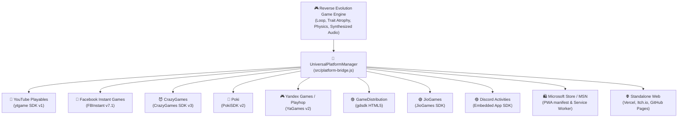
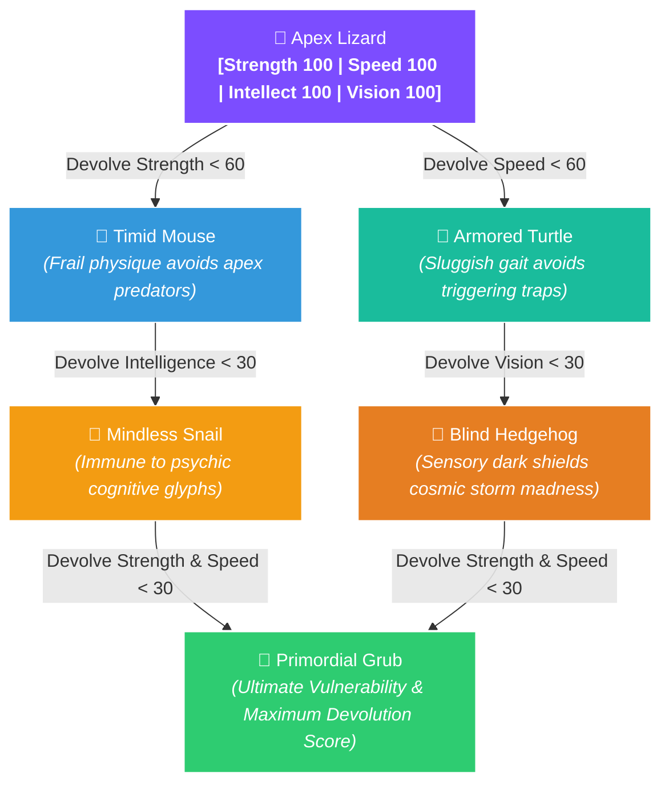

<div align="center">


<br/>

[](https://developers.google.com/youtube/gaming/playables)
[](https://developers.facebook.com/docs/games/instant-games)
[](https://docs.crazygames.com)
[](https://developers.poki.com)
[](https://yandex.com/dev/games/)
[](https://playhop.com)
[](https://gamedistribution.com)
[](https://jiogames.net)
[](https://discord.com/developers/docs/activities/overview)
[](https://partner.microsoft.com)
[-10B981?style=for-the-badge)](src/platform-bridge.js)

<br/>

<p align="center">
  <strong>Darwinian Natural Selection, turned completely on its head.</strong><br>
  <em>An inverted survival roguelite built with a modular <strong>Universal Multi-Platform Engine</strong>.<br>
  <strong>100% Native First-Party SDKs • Zero Playgama / Middleware Dependency • One Codebase for All Major Stores</strong></em>
</p>

<br/>

[🕹️ Play Game](#-gameplay--interface-showcase) • [🌐 Multi-Platform Matrix](#-universal-multi-platform-matrix) • [⚡ SDK Architecture](#-native-sdk-architecture-no-playgama) • [📦 Export & Packaging](#-one-click-multi-platform-packaging) • [🧪 Testing Guide](#-testing-any-platform-locally)

---

</div>

## 🎯 At a Glance

| Feature | Specification |
| :--- | :--- |
| **Cross-Platform Standard** | **12+ Native First-Party Platform Adapters** with zero revenue-share middleman |
| **Security & CSP** | **100% Zero-External-Asset Dependency**; Strict Content Security Policy compliant |
| **Monetization** | Native **Interstitial** & **Rewarded Ads** tailored for each portal's native ad network |
| **Cloud Persistence** | Native cloud saves (YouTube Cloud, Facebook Player Data, Yandex Player Data, LocalStorage) |
| **Audio Architecture** | Pure synthesized procedural soundwaves via **Web Audio API** (Oscillators) |
| **Platform Controls** | Dual-mode: Desktop Keyboard (`WASD` / `Arrows`) + Mobile **Virtual D-Pad & Touch** |

---

## 📸 Gameplay & Interface Showcase

<div align="center">
  
</div>

---

## 🌐 Universal Multi-Platform Matrix

Reverse Evolution integrates **directly and natively** with each platform's official SDK:

| Platform | Official Native SDK | Ads Support | Cloud Save | Leaderboards | Upload Format |
| :--- | :--- | :---: | :---: | :---: | :--- |
| 🔴 **YouTube Playables** | `ytgame` SDK v1 | Interstitial + Rewarded | `ytgame.game.saveData` | `ytgame.engagement` | `dist/youtube-bundle.zip` |
| 🔵 **Facebook Instant** | `FBInstant` v7.1 | Interstitial + Rewarded | `FBInstant.player.setDataAsync` | `FBInstant.getLeaderboardAsync` | `dist/facebook-bundle.zip` (`fbapp-config.json`) |
| 😈 **CrazyGames** | CrazyGames SDK v3 | Midgame + Rewarded | Cloud Account Sync | CrazyGames Leaderboards | `dist/crazygames-bundle.zip` |
| 🔵 **Poki** | PokiSDK v2 | Commercial + Rewarded | LocalStorage / Cloud | Poki High Scores | `dist/poki-bundle.zip` |
| 🎮 **Yandex Games** | YaGames SDK v2 | Fullscreen + Rewarded | `ysdk.getPlayer().setData()` | `ysdk.getLeaderboards()` | `dist/yandex-bundle.zip` |
| 🟩 **Playhop** | Playhop / YaGames v2 | Fullscreen + Rewarded | Player Cloud Data | Global Leaderboards | `dist/playhop-bundle.zip` |
| 🟣 **GameDistribution** | Azerion `gdsdk` | Interstitial + Rewarded | Local Storage Sync | GameDistribution API | `dist/gamedistribution-bundle.zip` |
| 🟢 **JioGames** | JioGames HTML5 SDK | Interstitial + Rewarded | Jio User Profile Sync | JioGames Leaderboards | `dist/jiogames-bundle.zip` |
| 🟣 **Discord Activities** | Embedded App SDK | Native Activity Overlay | Discord Cloud RPC | Guild High Scores | `dist/discord-bundle.zip` |
| 🛍️ **Microsoft Store** | PWA / Windows MSIX | Windows Ad SDK / Store | Windows Roaming AppData | Xbox Live / Store API | `dist/microsoft-bundle.zip` (`manifest.json` + `sw.js`) |
| 🦋 **MSN Games** | Microsoft Start Games | Preroll + Midgame | Microsoft Account Sync | MSN Leaderboards | `dist/microsoft-bundle.zip` |
| 🚀 **Lagged** | Lagged.com API | Interstitial + Rewarded | LocalStorage Sync | `LaggedAPI.Scores.save` | `dist/lagged-bundle.zip` |
| 🅈🄱 **Y8 Games** | Y8 ID & GameAPI | Preroll + Interstitial | Y8 Save API | `ID.GameAPI.CustomList` | `dist/y8-bundle.zip` |

---

## ⚡ Native SDK Architecture (No Playgama)

Rather than adding heavy third-party aggregator SDKs that introduce fees, bloat, and tracking, Reverse Evolution utilizes an ultra-clean **Polymorphic Platform Adapter Pattern** in [`src/platform-bridge.js`](file:///c:/Users/Rahul%20Kumar/Downloads/Github/Reverse-Evolution/src/platform-bridge.js):



### Unified Game API Calls

Your game core code calls a single clean interface:

```javascript
// 1. Lifecycle & Flow
platform.notifyFirstFrame();      // Dispatches ytgame.game.firstFrameReady or FBInstant setLoadingProgress
platform.notifyGameReady();       // Signals game is interactive & loading screen is dismissed
platform.gameplayStart();         // CrazyGames/Poki gameplay start signal
platform.gameplayStop();          // CrazyGames/Poki gameplay pause signal

// 2. Monetization (Native Ads)
await platform.showInterstitialAd(); // Triggers native interstitial/commercial break
const earned = await platform.showRewardedAd('reward-adapt-hint-101'); // Triggers native rewarded video

// 3. Cloud Data Persistence
await platform.saveData(state);   // Native cloud storage (YouTube, FBInstant player, Yandex player, LocalStorage)
const saved = await platform.loadData();

// 4. Social & Leaderboards
await platform.submitScore(score);// Pushes to YouTube leaderboards, FBInstant leaderboards, Yandex leaderboards
```

---

## 📦 One-Click Multi-Platform Packaging

To generate all ready-to-upload platform bundles and `.zip` packages, simply run:

```bash
# Using npm
npm run package

# Or using Node directly
node scripts/build-all-platforms.js
```

This compiles dedicated, pre-configured distribution packages in `dist/`:

```
dist/
├── 🔴 youtube-bundle.zip          ➔ Upload to YouTube Playables Developer Portal
├── 🔵 facebook-bundle.zip         ➔ Upload to Meta for Developers (Instant Games)
├── 😈 crazygames-bundle.zip       ➔ Upload to CrazyGames Developer Portal
├── 🔵 poki-bundle.zip             ➔ Upload to Poki for Developers
├── 🎮 yandex-bundle.zip           ➔ Upload to Yandex Games Console
├── 🟩 playhop-bundle.zip          ➔ Upload to Playhop Developer Dashboard
├── 🟣 gamedistribution-bundle.zip ➔ Upload to GameDistribution Console
├── 🟢 jiogames-bundle.zip         ➔ Upload to JioGames Developer Portal
├── 🟣 discord-bundle.zip          ➔ Upload to Discord Developer Portal
├── 🛍️ microsoft-bundle.zip        ➔ Package via PWABuilder for Microsoft Store
├── 🚀 lagged-bundle.zip           ➔ Upload to Lagged Publishing
└── 🅈🄱 y8-bundle.zip               ➔ Upload to Y8 Game Upload Portal
```

---

## 🧪 Testing Any Platform Locally

You can test any native platform adapter directly in your browser without leaving your desk!

### Method 1: Use the In-Game Platform Switcher
Click the **Platform Badge** in the top-right of the sidebar HUD to open the interactive Platform Switcher modal and test each platform's behavior.

### Method 2: Query Parameter Overrides
Append `?platform=<name>` to your URL:
- `http://localhost:8080/?platform=youtube` (Tests YouTube Playables adapter)
- `http://localhost:8080/?platform=facebook` (Tests Facebook Instant Games adapter)
- `http://localhost:8080/?platform=crazygames` (Tests CrazyGames SDK v3 adapter)
- `http://localhost:8080/?platform=poki` (Tests Poki SDK v2 adapter)
- `http://localhost:8080/?platform=yandex` (Tests Yandex Games adapter)
- `http://localhost:8080/?platform=playhop` (Tests Playhop adapter)
- `http://localhost:8080/?platform=gamedistribution` (Tests GameDistribution adapter)
- `http://localhost:8080/?platform=jiogames` (Tests JioGames adapter)
- `http://localhost:8080/?platform=discord` (Tests Discord Activities adapter)
- `http://localhost:8080/?platform=microsoft` (Tests Microsoft Store PWA adapter)
- `http://localhost:8080/?platform=standalone` (Tests Standalone Web offline fallback)

---

## 🧬 Metamorphic Morphologies

Your creature reacts immediately to trait loss with custom avatars, scale shifts, and movement kinetics:



---

## 🗺️ The Five Cosmic Strata

| Strata | Environment | The Hazard Threat | Required Condition | Tactical Advice |
| :---: | :--- | :--- | :---: | :--- |
| **I** | **The Hunting Grounds** | 🦁 Apex carnivores hunt high-protein prey | `Strength ≤ 30` | Atrophy muscles into jelly so predators perceive you as debris. |
| **II** | **The Maze of Minds** | ⚡ Arcane runes detonate upon cognitive scans | `Intelligence ≤ 40` | Dim cognitive neural fire. Ignorance is total safety. |
| **III** | **The Toxic Garden** | 🍄 Heavy spore clouds saturate large lung capacity | `Strength ≤ 20` | Shrink physical cellular size to minimize neurotoxin absorption. |
| **IV** | **The Blinding Storm** | 🌪️ Psychic aurora overloads sensitive optic nerves | `Vision ≤ 35` | Constrict pupils into soothing, restful darkness. |
| **V** | **The Final Test** | 🏛️ Crucible of Adaptability | `Exactly 1 Trait > 50` | Achieve asymmetric balance: keep one trait dominant and all others low. |

---

## 🕹️ Controls & Navigation

<div align="center">

| Action | Desktop Keyboard | Mobile / Touchscreen |
| :--- | :---: | :---: |
| **Move Up** | <kbd>↑</kbd> or <kbd>W</kbd> | Tap <kbd>▲</kbd> D-Pad or Tap Screen |
| **Move Left** | <kbd>←</kbd> or <kbd>A</kbd> | Tap <kbd>◀</kbd> D-Pad or Tap Screen |
| **Move Down** | <kbd>↓</kbd> or <kbd>S</kbd> | Tap <kbd>▼</kbd> D-Pad or Tap Screen |
| **Move Right** | <kbd>→</kbd> or <kbd>D</kbd> | Tap <kbd>▶</kbd> D-Pad or Tap Screen |
| **Devolve Traits** | Click **Devolve** on Trait Panel | Tap **Devolve** button |
| **Watch Rewarded Ad** | Click **🎁 Rewarded Aid** | Tap **🎁 Rewarded Aid** |
| **Pause Game** | Click **⏸️ Pause** | Tap **⏸️ Pause** |
| **Toggle Sound** | Click **🔊 Audio** | Tap **🔊 Audio** |

</div>

---

## 📂 Repository File Structure

```
Reverse-Evolution/
│
├── 🚀 index.html                  # Universal Adaptive Game Entrypoint (All Platforms)
├── 🔄 reverse-evolution-game.html # Synchronized legacy mirror
├── ⚙️ vercel.json                 # Vercel deployment routing & YouTube CSP headers
├── 📦 package.json                # Project build scripts (npm run package)
│
├── 📁 src/
│   └── platform-bridge.js         # Native Universal Platform Adapters (No Playgama)
│
├── 📁 platforms/                  # Standalone platform configurations
│   ├── facebook/                  # Facebook Instant Games (fbapp-config.json)
│   ├── microsoft-store/           # PWA manifest & Service Worker
│   └── ...                        # CrazyGames, Poki, Yandex, etc.
│
├── 📁 scripts/
│   └── build-all-platforms.js     # Multi-platform ZIP packaging tool
│
├── 📁 dist/                       # Ready-to-upload ZIP bundles for each portal
│
├── 🖼️ assets/
│   ├── banner.svg                 # Glowing neon hero banner
│   └── game-preview.svg           # Interface showcase mockup
│
├── 📘 types/
│   └── youtube-playables.d.ts     # Official TypeScript typings for ytgame SDK
│
└── 📖 README.md                   # Comprehensive Multi-Platform Showcase & Guide
```

---

## 🚀 Quick Start & Local Development

Run the game locally using any static web server:

```bash
# Clone the repository
git clone https://github.com/Rahul08319/Reverse-Evolution.git
cd Reverse-Evolution

# Start local server
npm start
# or: npx serve .
# or: python -m http.server 8080
```

---

<div align="center">

Crafted with 💜 for the **Global Web Gaming Ecosystem** • Created by [Rahul Kumar](https://github.com/Rahul08319)

[](https://github.com/Rahul08319)
[](https://github.com/Rahul08319/Reverse-Evolution)

</div>
