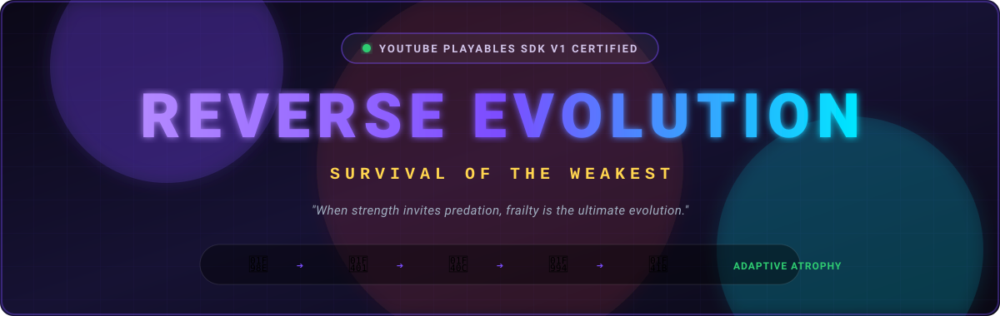
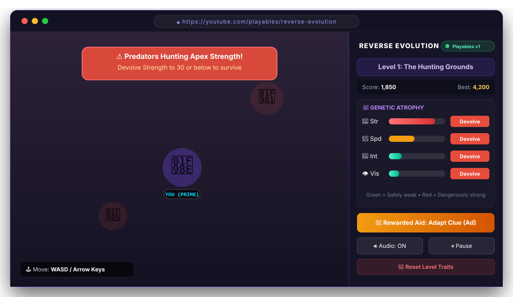
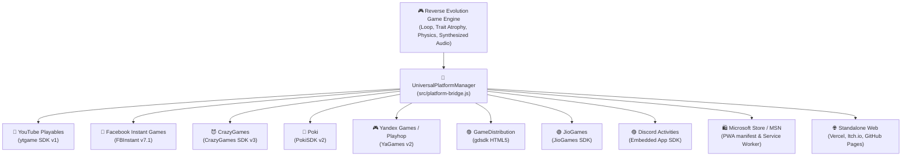
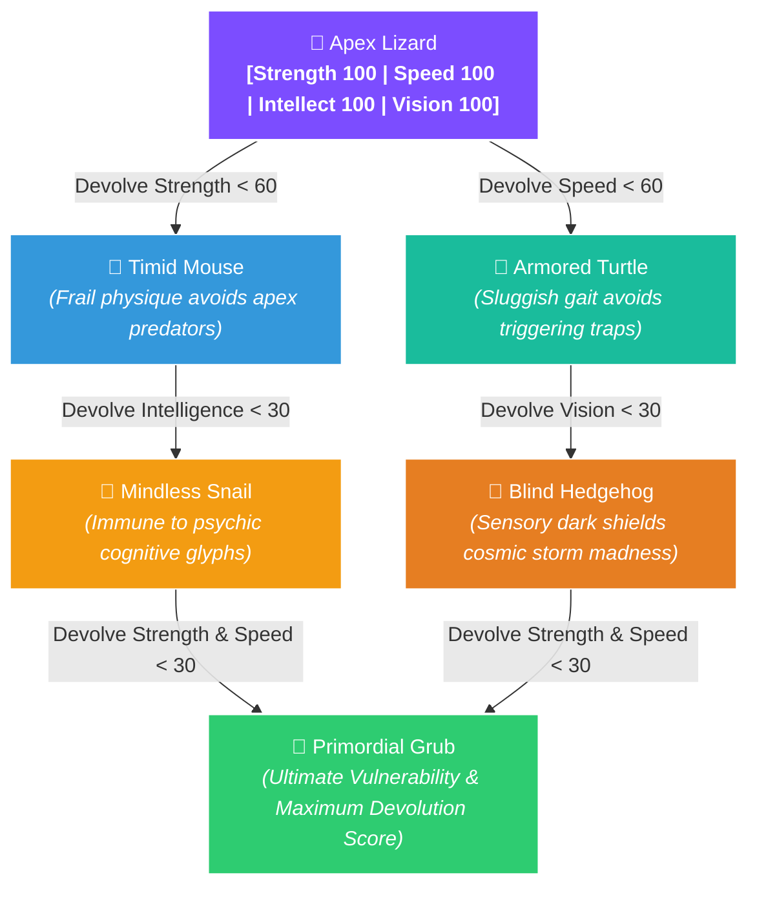

<div align="center">



<br/>
<br/>

[](https://vercel.com)
[](https://developers.google.com/youtube/gaming/playables)
[](https://developers.facebook.com/docs/games/instant-games)
[](https://docs.crazygames.com)
[](https://developers.poki.com)
[](https://yandex.com/dev/games/)
[](https://discord.com/developers/docs/activities/overview)
[](https://partner.microsoft.com)
[](src/platform-bridge.js)
[](#-apple-liquid-glass-design--fluid-physics)

<br/>

### *Darwinian Natural Selection, turned completely on its head.*
**An inverted survival roguelite crafted with Apple Liquid Glass aesthetics and a 100% native Universal Multi-Platform Engine.**

*Zero third-party aggregator middleware • Direct first-party portal SDKs • Single codebase for 12+ gaming ecosystems*

<br/>

[🕹️ Interface & Gameplay](#-gameplay--interface-showcase) • [💎 Apple Liquid Glass Design](#-apple-liquid-glass-design--fluid-physics) • [🌐 Multi-Platform Matrix](#-universal-multi-platform-matrix) • [⚡ SDK Architecture](#-native-sdk-architecture-zero-middleware) • [📦 One-Click Packaging](#-one-click-cross-platform-packaging) • [🧪 Testing Guide](#-testing-any-platform-locally)

---

</div>

## 🌟 Highlights & Architecture

```
                    ┌──────────────────────────────────────────────┐
                    │  REVERSE EVOLUTION: SURVIVAL OF THE WEAKEST  │
                    └──────────────────────┬───────────────────────┘
                                           │
         ┌─────────────────────────────────┴─────────────────────────────────┐
         ▼                                                                   ▼
┌─────────────────────────────────┐                       ┌─────────────────────────────────────┐
│    💎 APPLE LIQUID GLASS UI     │                       │     🔌 UNIVERSAL PLATFORM BRIDGE    │
├─────────────────────────────────┤                       ├─────────────────────────────────────┤
│ • Dynamic Island Floating HUD   │                       │ • YouTube Playables (ytgame v1)     │
│ • Backdrop-filter blur(28px)    │                       │ • Facebook Instant (FBInstant v7.1) │
│ • Specular top-edge highlights  │                       │ • CrazyGames SDK v3                 │
│ • 60 FPS Canvas Particle FX     │                       │ • Poki SDK v2                       │
│ • Kinetic Creature Banking      │                       │ • Yandex Games & Playhop (YaGames)  │
│ • Tactile Bento Trait Cards     │                       │ • GameDistribution & JioGames       │
│ • Synthesized Web Audio API     │                       │ • Discord Activities Embedded SDK   │
│ • Full reduced-motion fallback  │                       │ • Microsoft Store / MSN PWA         │
└─────────────────────────────────┘                       └─────────────────────────────────────┘
```

---

## 🎯 Executive Overview

| Capability | Engineering Specification |
| :--- | :--- |
| **Visual Architecture** | **Apple Liquid Glass Materials**: `blur(28px) saturate(190%)`, specular light edges, squircle borders |
| **HUD Innovations** | **Floating Dynamic Island**: Real-time status indicator dot, dynamic stratum titles, tactile audio pill |
| **Motion Physics** | **Velocity Banking**: Creature tilts into motion vectors with critically-damped spring recovery |
| **Particle System** | **Canvas FX (60 FPS)**: Drifting bioluminescent stardust, species particle trail, touch shockwave ripples |
| **Multi-Platform Standard** | **12+ Native First-Party Adapters**: Direct integration without Playgama or aggregator middleman |
| **Packaging Engine** | **Cross-Platform Pure Node.js ZIP**: Zero external CLI dependencies (`powershell`, `zip`, `7z` not required) |
| **Security & CSP** | **100% Self-Contained Assets**: YouTube Playables CSP & sandbox compliant; zero external CDN dependencies |
| **Cloud Persistence** | Native auto-saves mapped to YouTube Cloud Data, Facebook Player Storage, and Yandex Cloud |
| **Acoustic Design** | Procedural waveform generation via **Web Audio API** (OscillatorNodes with logarithmic decay) |
| **Input System** | Hybrid: Desktop Keyboard (`WASD` / `Arrows`), Point-and-Click, and Mobile **Glass D-Pad** |

---

## 📸 Gameplay & Interface Showcase

<div align="center">
  
</div>

---

## 💎 Apple Liquid Glass Design & Fluid Physics

Reverse Evolution has been designed from the ground up according to Apple's design philosophy and fluid interface principles:

### 1. Translucent Liquid Glass Materials
- **Optical Depth**: Panels and sidebars utilize a dual-layer glass recipe:
  ```css
  background: rgba(20, 20, 44, 0.68);
  backdrop-filter: blur(28px) saturate(190%);
  border: 1px solid rgba(255, 255, 255, 0.10);
  border-top-color: rgba(255, 255, 255, 0.18); /* Specular top highlight */
  box-shadow: 0 8px 32px rgba(0, 0, 0, 0.6);
  ```
- **Semantic Palette**: Dynamic system tokens (`--system-blue: #0A84FF`, `--system-green: #30D158`, `--system-red: #FF453A`, `--system-orange: #FF9F0A`, `--system-purple: #BF5AF2`, `--system-teal: #64D2FF`).

### 2. Floating Dynamic Island Capsule
- Anchored at the top-center of the cosmic viewport.
- Contains a live **Hazard State Indicator Dot**:
  - 🟢 **Safe** — Genetic traits satisfy survival threshold.
  - 🟠 **Warning** — Within 25 units of lethal exposure.
  - 🔴 **Danger** — Apex predators or environmental hazards actively targeting high traits.
- Tactile spring audio toggle providing instantaneous auditory feedback.

### 3. Canvas Particle FX Engine
- Overlayed `<canvas id="particleCanvas">` rendering 3 distinct visual layers at 60 FPS:
  - **Bioluminescent Stardust**: ~55 ambient particles with sinusoidal drift and opacity oscillation.
  - **Species Particle Wake**: Bioluminescent trail emitting from creature motion, dynamically color-coded to the current metamorphic form.
  - **Touch Shockwaves**: Expanding harmonic ripple rings generated on pointer-down.

### 4. Kinetic Banking & Metamorphic Burst
- **Movement Banking**: The creature dynamically leans and tilts in response to its velocity vector using critically-damped lerp smoothing (`_bankAngle`).
- **Elastic Metamorphic Burst**: Devolution steps trigger an elastic scale-bounce animation (`🦎` $\to$ `🐢` $\to$ `🐁` $\to$ `🦔` $\to$ `🐌` $\to$ `🐛`).
- **Tactile Bento Cards**: Each trait is housed in a squircle bento container with live color-coded meter, numeric badge, and tactile active press response (`scale(0.91)`).

---

## 🌐 Universal Multi-Platform Matrix

Reverse Evolution integrates **directly and natively** with each platform's official SDK:

| Platform | Official Native SDK | Ads Engine | Cloud Persistence | Leaderboards | Output Package |
| :--- | :--- | :---: | :---: | :---: | :--- |
| 🔴 **YouTube Playables** | `ytgame` SDK v1 | Interstitial + Rewarded | `ytgame.game.saveData` | `ytgame.engagement` | `dist/youtube-bundle.zip` |
| 🔵 **Facebook Instant** | `FBInstant` v7.1 | Interstitial + Rewarded | `FBInstant.player.setDataAsync` | `FBInstant.getLeaderboardAsync` | `dist/facebook-bundle.zip` (`fbapp-config.json`) |
| 😈 **CrazyGames** | CrazyGames SDK v3 | Midgame + Rewarded | Cloud Account Sync | CrazyGames Leaderboards | `dist/crazygames-bundle.zip` |
| 🔵 **Poki** | PokiSDK v2 | Commercial + Rewarded | LocalStorage / Cloud | Poki High Scores | `dist/poki-bundle.zip` |
| 🎮 **Yandex Games** | YaGames SDK v2 | Fullscreen + Rewarded | `ysdk.getPlayer().setData()` | `ysdk.getLeaderboards()` | `dist/yandex-bundle.zip` |
| 🟩 **Playhop** | Playhop / YaGames v2 | Fullscreen + Rewarded | Player Cloud Data | Global Leaderboards | `dist/playhop-bundle.zip` |
| 🟣 **GameDistribution** | Azerion `gdsdk` | Interstitial + Rewarded | Local Storage Sync | GameDistribution API | `dist/gamedistribution-bundle.zip` |
| 🟢 **JioGames** | JioGames HTML5 SDK | Interstitial + Rewarded | Jio User Profile Sync | JioGames Leaderboards | `dist/jiogames-bundle.zip` |
| 🟣 **Discord Activities** | Embedded App SDK | Native Activity Overlay | Discord Cloud RPC | Guild High Scores | `dist/discord-bundle.zip` |
| 🛍️ **Microsoft Store** | PWA / Windows MSIX | Windows Ad SDK / Store | Windows Roaming AppData | Xbox Live / Store API | `dist/microsoft-bundle.zip` (`manifest.json` + `sw.js`) |
| 🦋 **MSN Games** | Microsoft Start Games | Preroll + Midgame | Microsoft Account Sync | MSN Leaderboards | `dist/microsoft-bundle.zip` |
| 🚀 **Lagged** | Lagged.com API | Interstitial + Rewarded | LocalStorage Sync | `LaggedAPI.Scores.save` | `dist/lagged-bundle.zip` |
| 🅈🄱 **Y8 Games** | Y8 ID & GameAPI | Preroll + Interstitial | Y8 Save API | `ID.GameAPI.CustomList` | `dist/y8-bundle.zip` |

---

## ⚡ Native SDK Architecture (Zero Middleware)

Rather than adding heavy third-party aggregator SDKs that introduce revenue splits, telemetry bloat, and publishing delays, Reverse Evolution utilizes an ultra-clean **Polymorphic Platform Adapter Pattern** in [`src/platform-bridge.js`](src/platform-bridge.js):



### Unified Game API Calls

Your game core code interacts with a single, clean platform contract:

```javascript
// 1. Lifecycle & Loading Handshake
platform.notifyFirstFrame();      // Dispatches ytgame.game.firstFrameReady or FBInstant setLoadingProgress
platform.notifyGameReady();       // Dismisses platform loading veil & unpauses game loop
platform.gameplayStart();         // Signals active user engagement (CrazyGames/Poki)
platform.gameplayStop();          // Signals pause or menu transition

// 2. Native Portal Monetization
await platform.showInterstitialAd();                                  // Triggers native commercial break
const rewarded = await platform.showRewardedAd('reward-adapt-hint');  // Grants in-game trait adaptation

// 3. Persistent Cloud Saves
await platform.saveData(gameState);                                   // Dispatches to YouTube/Facebook/Yandex cloud
const savedState = await platform.loadData();

// 4. Social & High Scores
await platform.submitScore(score);                                    // Broadcasts to platform leaderboards
```

---

## 📦 One-Click Cross-Platform Packaging

The repository includes a **zero-dependency, cross-platform packaging engine** powered by Node's native `zlib`:

```bash
# Using npm
npm run package

# Or using Node directly
node scripts/build-all-platforms.js
```

This compiles ready-to-upload bundles in `dist/` and synchronizes the `public/` directory for Vercel deployment:

```
dist/
├── 🔴 youtube-bundle.zip          ➔ Upload to YouTube Playables Developer Portal
├── 🔵 facebook-bundle.zip         ➔ Upload to Meta for Developers (Instant Games)
├── 😈 crazygames-bundle.zip       ➔ Upload to CrazyGames Developer Portal
├── 🔵 poki-bundle.zip             ➔ Upload to Poki for Developers
├── 🎮 yandex-bundle.zip           ➔ Upload to Yandex Games Console
├── 🟩 playhop-bundle.zip          ➔ Upload to Playhop Developer Dashboard
├── 🟣 gamedistribution-bundle.zip ➔ Upload to GameDistribution Console
├── 🟢 jiogames-bundle.zip         ➔ Upload to JioGames Developer Portal
├── 🟣 discord-bundle.zip          ➔ Upload to Discord Developer Portal
├── 🛍️ microsoft-bundle.zip        ➔ Package via PWABuilder for Microsoft Store
├── 🚀 lagged-bundle.zip           ➔ Upload to Lagged Publishing
└── 🅈🄱 y8-bundle.zip               ➔ Upload to Y8 Game Upload Portal
```

---

## 🧪 Testing Any Platform Locally

Test every single platform adapter directly in your browser without leaving your local environment:

### Method 1: Interactive In-Game Switcher
Click the **Platform Badge** in the top-right of the HUD sidebar to open the modal and test any platform's behavior instantly.

### Method 2: Query Parameter Overrides
Append `?platform=<id>` to your local URL:
- `http://localhost:8080/?platform=youtube` (YouTube Playables)
- `http://localhost:8080/?platform=facebook` (Facebook Instant Games)
- `http://localhost:8080/?platform=crazygames` (CrazyGames SDK v3)
- `http://localhost:8080/?platform=poki` (Poki SDK v2)
- `http://localhost:8080/?platform=yandex` (Yandex Games)
- `http://localhost:8080/?platform=playhop` (Playhop)
- `http://localhost:8080/?platform=gamedistribution` (GameDistribution)
- `http://localhost:8080/?platform=jiogames` (JioGames)
- `http://localhost:8080/?platform=discord` (Discord Activities)
- `http://localhost:8080/?platform=microsoft` (Microsoft Store PWA)
- `http://localhost:8080/?platform=standalone` (Standalone Web)

---

## 🧬 Metamorphic Evolution Tree

The creature's physical manifestation responds directly to trait atrophy:



---

## 🗺️ The Five Cosmic Strata

| Stratum | Title | The Environmental Threat | Survival Condition | Tactical Biological Rationale |
| :---: | :--- | :--- | :---: | :--- |
| **I** | **The Hunting Grounds** | 🦁 Apex carnivores hunt high-protein prey | `Strength ≤ 30` | Atrophy muscles into cellular jelly so predators perceive you as harmless debris. |
| **II** | **The Maze of Minds** | ⚡ Arcane runes detonate upon cognitive scans | `Intelligence ≤ 40` | Dim neural synapses. Ignorance allows safe passage through cognitive traps. |
| **III** | **The Toxic Garden** | 🍄 Heavy spore clouds saturate large lung capacity | `Strength ≤ 20` | Shrink physical cellular size to minimize neurotoxin absorption. |
| **IV** | **The Blinding Storm** | 🌪️ Psychic aurora overloads sensitive optic nerves | `Vision ≤ 35` | Constrict pupils into soothing darkness; sensory rest shields sanity. |
| **V** | **The Final Test** | 🏛️ Crucible of Adaptability | `Exactly 1 Trait > 50` | Achieve asymmetric balance: keep one trait dominant and all others low. |

---

## 🕹️ Controls & Navigation

<div align="center">

| Action | Desktop Keyboard | Mobile / Touchscreen |
| :--- | :---: | :---: |
| **Move Up** | <kbd>↑</kbd> or <kbd>W</kbd> | Tap <kbd>▲</kbd> Glass D-Pad or Tap Screen |
| **Move Left** | <kbd>←</kbd> or <kbd>A</kbd> | Tap <kbd>◀</kbd> Glass D-Pad or Tap Screen |
| **Move Down** | <kbd>↓</kbd> or <kbd>S</kbd> | Tap <kbd>▼</kbd> Glass D-Pad or Tap Screen |
| **Move Right** | <kbd>→</kbd> or <kbd>D</kbd> | Tap <kbd>▶</kbd> Glass D-Pad or Tap Screen |
| **Devolve Traits** | Click **Devolve** on Trait Panel | Tap **Devolve** Bento Button |
| **Watch Rewarded Ad** | Click **🎁 Rewarded Aid** | Tap **🎁 Rewarded Aid** |
| **Pause Game** | Click **⏸️ Pause** | Tap **⏸️ Pause** |
| **Toggle Sound** | Click **🔊 Audio** / Dynamic Island | Tap **🔊 Audio** Pill |

</div>

---

## 📂 Repository File Structure

```
Reverse-Evolution/
├── 🚀 index.html                  # Universal Adaptive Game Entrypoint (Apple Liquid Glass)
├── 🔄 reverse-evolution-game.html # Synchronized legacy mirror
├── ⚙️ vercel.json                 # Vercel deployment routing & YouTube CSP headers
├── 📦 package.json                # Project build scripts (npm run package)
│
├── 📁 src/
│   └── platform-bridge.js         # Native Universal Platform Adapters (No Playgama)
│
├── 📁 public/                     # Vercel auto-synchronized deployment output
│   ├── index.html                 # Apple Liquid Glass production entrypoint
│   ├── reverse-evolution-game.html
│   ├── src/                       # Native platform bridge
│   ├── assets/                    # Optimized vector graphics
│   └── dist/                      # Downloadable platform bundles
│
├── 📁 platforms/                  # Standalone platform configurations
│   ├── facebook/                  # Facebook Instant Games (fbapp-config.json)
│   ├── microsoft-store/           # PWA manifest & Service Worker
│   └── ...                        # CrazyGames, Poki, Yandex, etc.
│
├── 📁 scripts/
│   └── build-all-platforms.js     # Cross-platform pure Node.js packaging engine
│
├── 📁 dist/                       # Ready-to-upload ZIP bundles for each portal
│
├── 🖼️ assets/
│   ├── banner.svg                 # Glowing neon hero banner
│   └── game-preview.svg           # Interface showcase mockup
│
├── 📘 types/
│   └── youtube-playables.d.ts     # Official TypeScript declarations for ytgame SDK
│
└── 📖 README.md                   # Comprehensive Multi-Platform Showcase & Guide
```

---

## 🚀 Quick Start & Local Development

Run the game locally using any static web server:

```bash
# 1. Clone the repository
git clone https://github.com/Rahul08319/Reverse-Evolution.git
cd Reverse-Evolution

# 2. Package all platform bundles (optional)
npm run package

# 3. Start local development server
npm start
# or: npx serve .
# or: python -m http.server 8080
```

---

<div align="center">

Crafted with 💜 for the **Global Web Gaming Ecosystem** • Created by [Rahul Kumar](https://github.com/Rahul08319)

[](https://github.com/Rahul08319)
[](https://github.com/Rahul08319/Reverse-Evolution)

</div>
